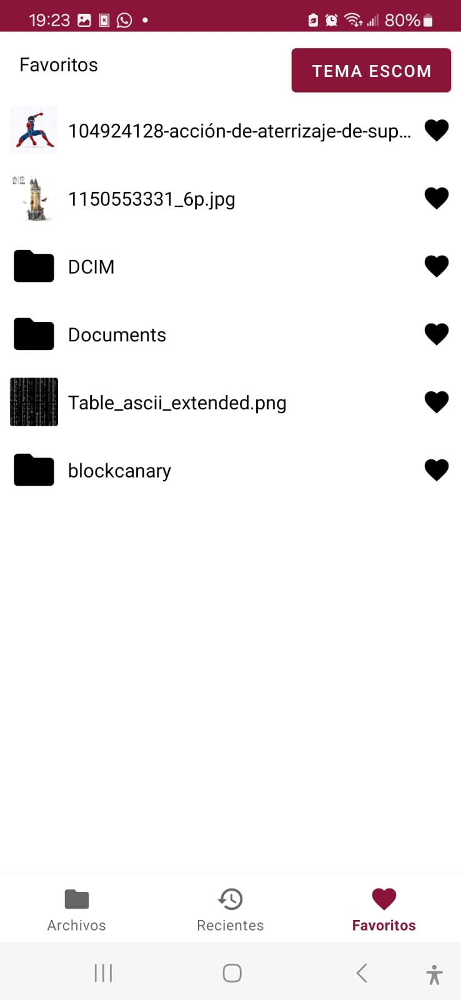
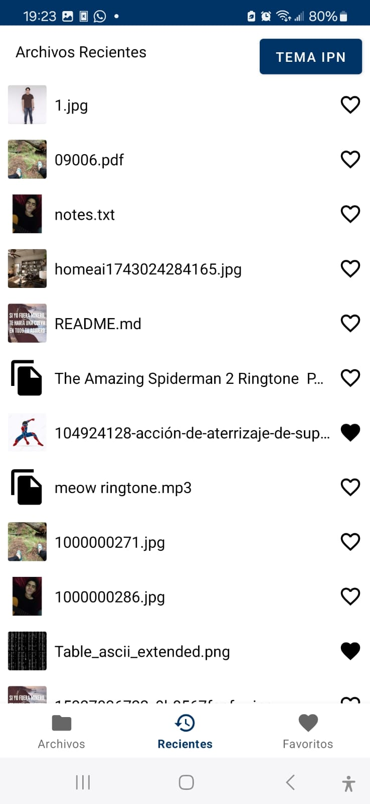
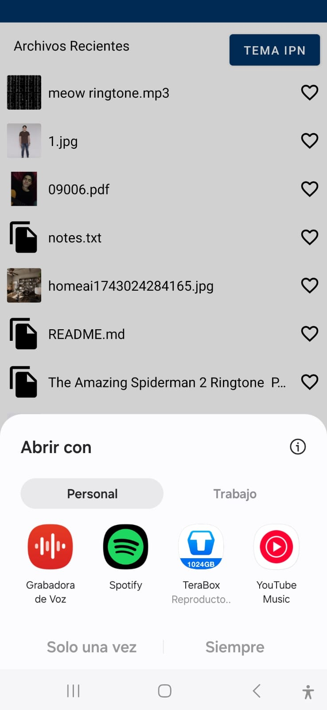
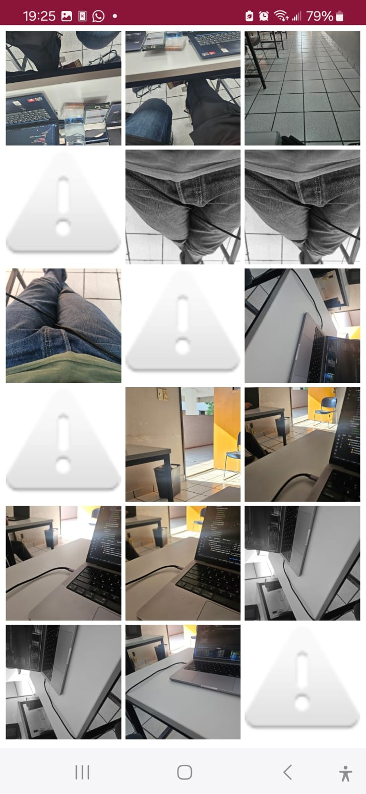

# Práctica de Desarrollo de Aplicaciones Nativas Android con Kotlin

## Introducción

Este proyecto documenta el desarrollo de dos aplicaciones nativas para la plataforma Android utilizando el lenguaje de programación Kotlin. Las aplicaciones desarrolladas son:

1.  **Gestor de Archivos:** Una utilidad para explorar y gestionar el almacenamiento del dispositivo.
2.  **Aplicación de Cámara y Micrófono:** Una herramienta para capturar y organizar contenido multimedia.

La motivación principal detrás de estos desarrollos fue profundizar en las particularidades del ecosistema Android, incluyendo sus APIs nativas, mecanismos de seguridad, gestión de permisos, diseño de interfaces de usuario y estrategias de almacenamiento local. Este enfoque se eligió para complementar la experiencia previa con soluciones multiplataforma (Flutter) y desarrollo en iOS, buscando una comprensión más completa del desarrollo específico para Android.

## Desarrollo de Aplicaciones

### Ejercicio 1: Gestor de Archivos para Android (Kotlin)

#### 1. Funcionalidades Principales:
*   **Exploración de Almacenamiento:** Navegación por el almacenamiento interno y externo del dispositivo.
*   **Visualización Jerárquica:** Presentación clara de la estructura de carpetas y archivos.
*   **Apertura de Archivos:**
    *   Soporte integrado para archivos de texto (ej. `.txt`, `.md`).
    *   Visualizador de imágenes con funcionalidades de zoom y rotación.
*   **Manejo de Archivos No Soportados:** Diálogo que ofrece la opción de abrir archivos con aplicaciones externas instaladas en el sistema.

#### 2. Interfaz de Usuario (UI):
*   **Temas Personalizables:**
    *   Tema "Guinda" (inspirado en el IPN).
    *   Tema "Azul" (inspirado en ESCOM).
*   **Adaptación Dinámica:** Soporte automático para los modos claro y oscuro del sistema operativo.
*   **Diseño Responsivo:** Interfaz optimizada para adaptarse a diferentes tamaños y orientaciones de pantalla.

#### 3. Almacenamiento Local:
*   **Historial de Archivos Recientes:** Implementado utilizando `SharedPreferences` para un acceso rápido a los archivos usados con frecuencia.
*   **Sistema de Favoritos:** Gestión de archivos favoritos mediante la librería de persistencia `Room`.
*   **Caché de Miniaturas:** Almacenamiento en caché de miniaturas de imágenes para mejorar el rendimiento y la fluidez de la interfaz.

#### 4. Permisos y Seguridad:
*   **Gestión Moderna de Permisos:** Solicitud y manejo de permisos en tiempo de ejecución utilizando `ActivityResultContracts`.
*   **Manejo de Errores:** Implementación de manejo de excepciones para rutas de archivo inaccesibles.
*   **Scoped Storage:** Cumplimiento de las restricciones de seguridad modernas de Android, incluyendo el almacenamiento específico (scoped storage).

---

### Ejercicio 2: Aplicación de Cámara y Micrófono para Android (Kotlin)

#### 1. Funcionalidades Principales:
*   **Captura de Fotografías:** Funcionalidad para tomar fotos utilizando la cámara del dispositivo.
*   **Grabación de Audio:** Capacidad para grabar audio a través del micrófono.
*   **Almacenamiento Organizado:** Los archivos capturados (fotos y audios) se guardan de forma estructurada.

#### 2. Galería Integrada:
*   **Visualizador de Imágenes:** Galería para ver las fotos capturadas, con opciones básicas de edición (ej. recortar, rotar, aplicar filtros).
*   **Reproductor de Audio:** Interfaz para reproducir las grabaciones de audio almacenadas.
*   **Organización Cronológica:** El contenido multimedia en la galería se organiza por fecha de creación.

#### 3. Interfaz de Usuario (UI):
*   **Tematización Consistente:** Utilización de la misma paleta de temas ("Guinda" y "Azul") que el Gestor de Archivos.
*   **Modo Claro/Oscuro:** Adaptación automática al tema del sistema.
*   **Diseño Intuitivo:** Controles de fácil acceso y una experiencia de usuario fluida.

## Pruebas Realizadas

Las aplicaciones fueron sometidas a pruebas en el siguiente entorno:

*   **Dispositivo Físico:** Samsung Galaxy S23 Plus
*   **Versión de Android:** Android 14

### Resultados de las Pruebas:
*   **Adaptación de UI:** La interfaz de usuario se adaptó correctamente a diferentes configuraciones de pantalla.
*   **Estabilidad:** Ambas aplicaciones demostraron un funcionamiento estable durante los cambios de tema y la alternancia entre los modos claro y oscuro del sistema.
*   **Gestión de Permisos:** Los permisos de la aplicación fueron solicitados y gestionados adecuadamente en todos los escenarios probados.

## Conclusiones

Esta práctica ha sido fundamental para consolidar y expandir los conocimientos en el desarrollo de aplicaciones nativas para Android utilizando Kotlin. Se abordaron y aplicaron conceptos clave, tales como:

*   La gestión moderna de permisos en tiempo de ejecución.
*   Las implicaciones y la implementación del almacenamiento específico (Scoped Storage) y otras restricciones de seguridad.
*   El diseño y desarrollo de interfaces de usuario adaptables, incluyendo la tematización y el soporte para el modo oscuro.
*   La integración con hardware del dispositivo como la cámara y el micrófono, y la gestión del almacenamiento de los datos generados.

El desarrollo de estas aplicaciones representó un desafío estimulante que contribuyó significativamente a mejorar la comprensión del ciclo de vida de las actividades en Android, el uso efectivo de los `ActivityResultContract` para la comunicación entre componentes, y la implementación de interfaces de usuario modernas y responsivas.

## Bibliografía y Recursos Utilizados

*   Android Developers. (2024). *Storage use in Android*. [https://developer.android.com/guide/topics/data](https://developer.android.com/guide/topics/data)
*   CanHub. (2024). *Android Image Cropper*. [https://github.com/CanHub/Android-Image-Cropper](https://github.com/CanHub/Android-Image-Cropper)
*   Google Developers. (2024). *CameraX API*. [https://developer.android.com/training/camerax](https://developer.android.com/training/camerax)
*   Android Developers. (2024). *Room Persistence Library*. [https://developer.android.com/jetpack/androidx/releases/room](https://developer.android.com/jetpack/androidx/releases/room)
*   Kotlin Programming Language. (2024). *Kotlin Documentation*. [https://kotlinlang.org/docs/home.html](https://kotlinlang.org/docs/home.html)

---

## Capturas de Pantalla

### Gestor de Archivos:

### Aplicación de Cámara y Micrófono:

