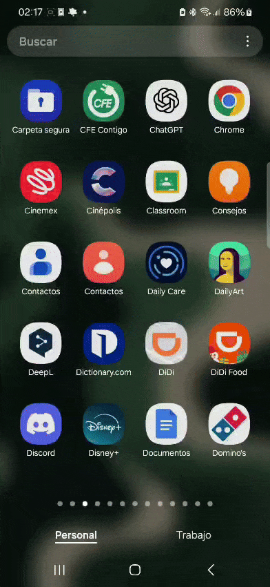

# Consumo de API pública
## Descripción
Este proyecto es un ejemplo de consumo de una API pública, en este caso la API de [The Rick and Morty API](https://rickandmortyapi.com/). La API de Rick and Morty es una API REST que contiene información sobre los personajes de la serie de televisión Rick and Morty. En este proyecto se consume la API para obtener información sobre los personajes de la serie.
## Como ejecutar
Para ejecutar el proyecto se debe clonar la carpeta del proyecto, importarla a Android Studio y ejecutarla en un emulador o dispositivo físico.
## Arquitectura del proyecto
<!-- images/arquiT3.png -->

## Capturas de pantalla
<!-- images/captura1.jpeg -->

<!-- images/captura2.jpeg -->

<!-- images/captura3.jpeg -->

## App funcionando
<!-- images/app.gif -->
 
## Autor
- Salvador Costilla Caballero