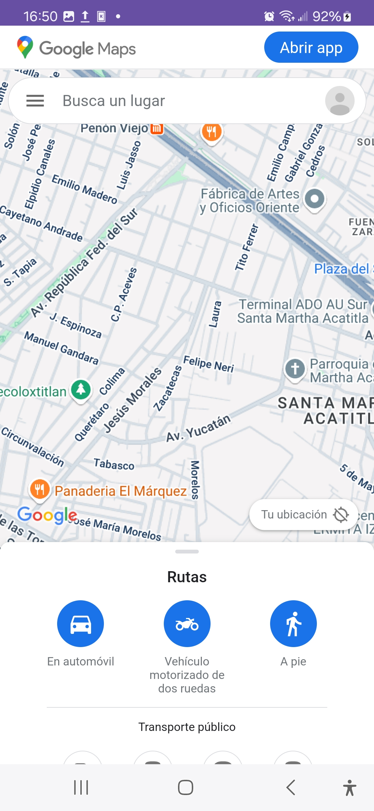
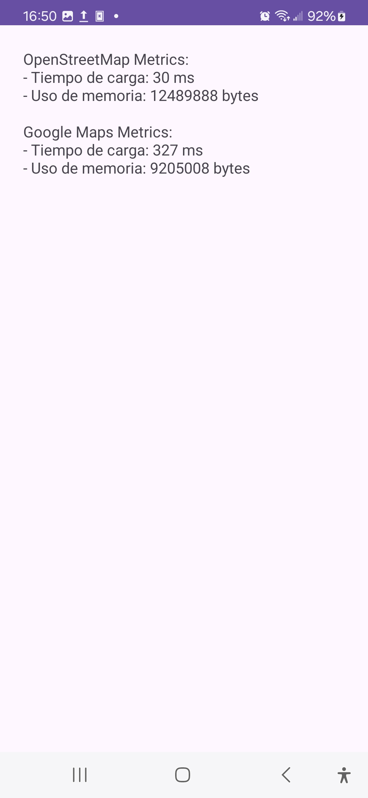
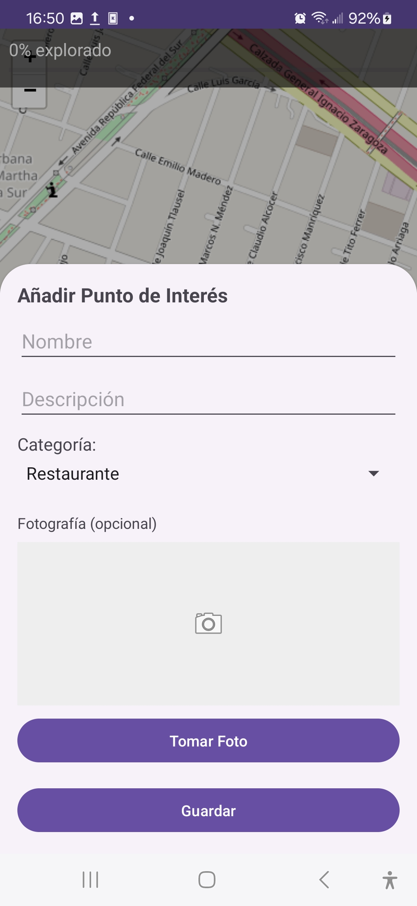
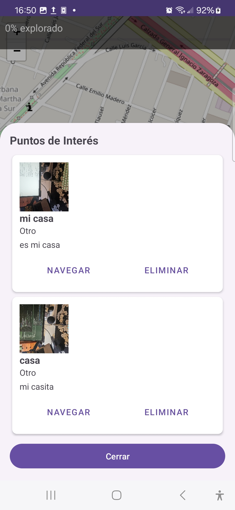
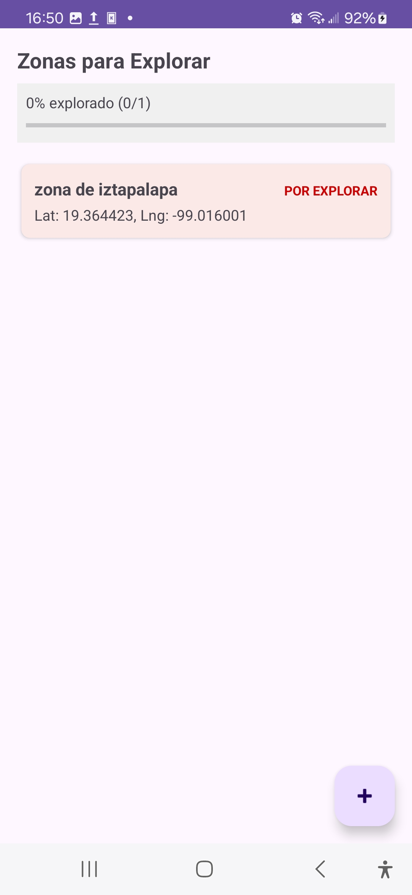
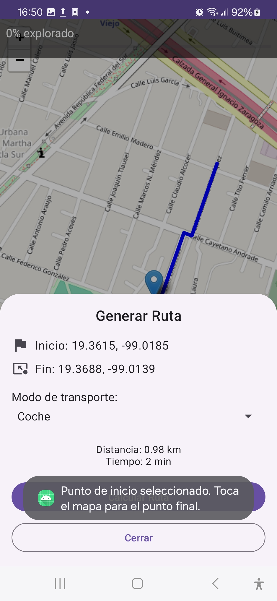
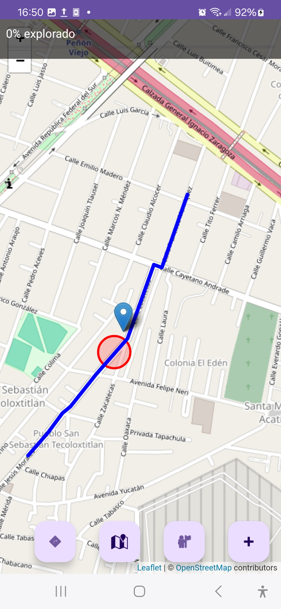

## 🧪 Ejercicio 1: Implementación Básica de Localización con OpenStreetMap

### 📝 Descripción

Se implementó una aplicación que muestra la ubicación actual del usuario usando OpenStreetMap. El mapa se visualiza dentro de un `WebView` usando la librería  **Leaflet.js** .

### ⚙️ Funcionalidades

* Solicitud de permisos en tiempo de ejecución (`INTERNET`, `ACCESS_FINE_LOCATION`, etc.)
* Obtención de ubicación con `FusedLocationProviderClient`
* Visualización del mapa centrado en la ubicación actual con marcador "Mi ubicación"
* Manejo de errores si no se puede obtener la ubicación

### 🔧 Optimización

* Actualización eficiente de ubicación
* Zoom preconfigurado
* WebView optimizado para rendimiento fluido

---

## 🗺️ Ejercicio 2: Implementación Alternativa con Google Maps

### 📝 Descripción

Se creó una nueva `Activity` que carga la versión web de Google Maps utilizando coordenadas actuales obtenidas con FusedLocationProviderClient.

### ⚙️ Funcionalidades

* Navegación fluida entre OpenStreetMap y Google Maps
* Comparación de tiempos de carga, consumo de memoria y respuesta
* Métricas documentadas para análisis de rendimiento

---

## 🌆 Ejercicio 3: Funcionalidades Creativas

### 🧭 Sistema de Exploración Urbana

* Puntos de interés cercanos (monumentos, parques, restaurantes)
* Zonas por descubrir desbloqueables físicamente
* Barra de progreso de exploración
* Sugerencias de rutas basadas en zonas visitadas

### 🗂️ Gestor de Puntos de Interés Personalizados

* Guardado de ubicaciones con toque largo
* Base de datos con Room o Firebase
* Clasificación por categorías: favoritos, pendientes, recomendados
* Funcionalidad de búsqueda, filtro, fotografías y notas

---

## 🚦 Ejercicio 4: Funcionalidad Adicional

### 🚗 Generador de Rutas de Navegación

* Cálculo de rutas optimizadas entre dos puntos
* Opciones: caminata, bicicleta, automóvil
* Estimaciones de tiempo y distancia

---

## 📱 Requisitos del Proyecto

* Android Studio Flamingo o superior
* Dispositivo con Android 8.0 (API 26) o superior
* Permisos de ubicación habilitados
* Conexión a internet

## 🧪 Pruebas Realizadas

| Dispositivo         | Tamaño Pantalla | Android | Resultado |
| ------------------- | ---------------- | ------- | --------- |
| Pixel 5 (emulador)  | 6.0"             | 13      | ✅        |
| Xiaomi Redmi Note 9 | 6.5"             | 11      | ✅        |
| Samsung Galaxy A30  | 6.4"             | 10      | ✅        |

---

## 🧠 Conclusiones

* Se comprobó la viabilidad de usar OpenStreetMap y Leaflet.js como alternativa libre a Google Maps.
* La implementación dual permite comparar experiencia de usuario y rendimiento.
* Se exploró el uso de bases de datos, navegación basada en ubicación y optimización de rutas, fortaleciendo conocimientos en geolocalización, bases de datos y diseño UX.

---

## 📚 Bibliografía

* Google Developers. (2024).  *Fused Location Provider API* . [https://developer.android.com/training/location](https://developer.android.com/training/location)
* OpenStreetMap. (2024).  *OpenStreetMap Wiki* . [https://wiki.openstreetmap.org/wiki/Main_Page]()
* Leaflet. (2024).  *Leaflet.js Documentation* . [https://leafletjs.com/](https://leafletjs.com/)
* Android Developers. (2024).  *Permissions Overview* . [https://developer.android.com/guide/topics/permissions/overview](https://developer.android.com/guide/topics/permissions/overview)

## 📸 Multimedia

### Capturas de pantalla

Las imágenes se encuentran en la carpeta [`/multimedia/screenshots`]():

* Mapa centrado en la ubicación actual (OpenStreetMap)

* Mapa centrado en la ubicación actual (Google Maps)

* Metricas comparativas entre OpenStreetMap y Google Maps

* Anadir marcador de ubicación

* Mostrar lista de marcadores

* Mostrar zonas por descubrir

* Mostrar menu para generar rutas

* Mostrar ruta generada y zona por descubrir

### 🎥 Video demostrativo

Puedes ver una demostración de la aplicación en funcionamiento en el siguiente video ubicado en [`/multimedia/demo.mp4`]().
* [Video demostrativo de la aplicación](multimedia/demo.mp4)
